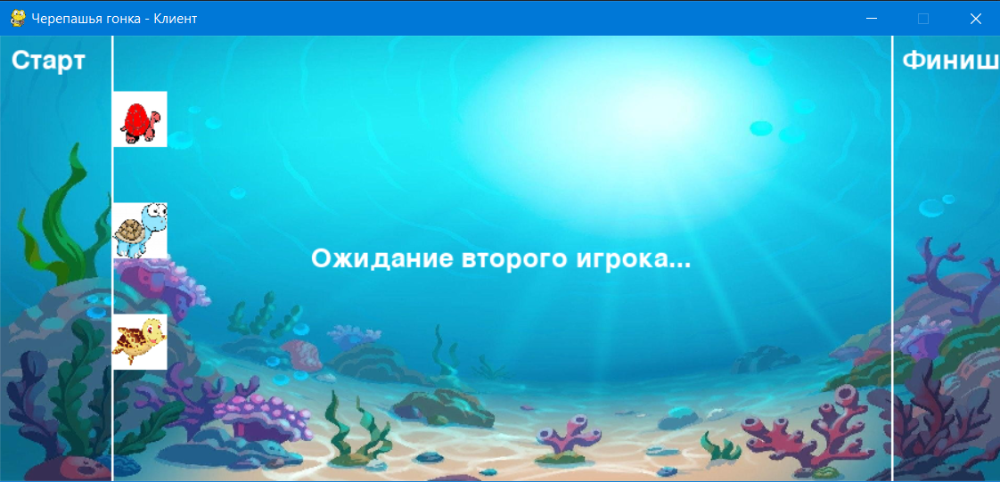

## Turtle-Race-Game

Черепашья Гонка — это многопользовательская игра, в которой два или трое игроков управляют черепашками, соревнуясь друг с другом, чтобы первыми достичь финишной линии. Игра реализована с использованием библиотеки Pygame для графики и сокетов для сетевого взаимодействия. Игра поддерживается на всех основных операционных системах: Windows, macOS и Linux.

###  Инструкция установки:

1.Скачать Pygame

```commandline
pip install pygame
```

2.Скачать игру с репозитория

```commandline
git clone https://github.com/s1v444/turtle-race-game.git
```

### Инструкция запуска:

1.Запустить сервер

```commandline
python Server/main.py
```

2.Запустить игру 
- <ip адрес сервера> - локальный адрес компьютера на котором запущен сервер

```commandline
python Game/Game.py <ip адрес сервера> 
```

3.После каждой сыгранной игры нужно перезапускать сервер

### Правила игры

* Сначала нужно дождаться подключения минимум 2 игроков
* После нужно нажимать пробел, чтобы добраться до финиша первым
*  Выигрывает тот, кто приходит первым

### Управление 

* Пробел - двигаться

### Скриншот игры
